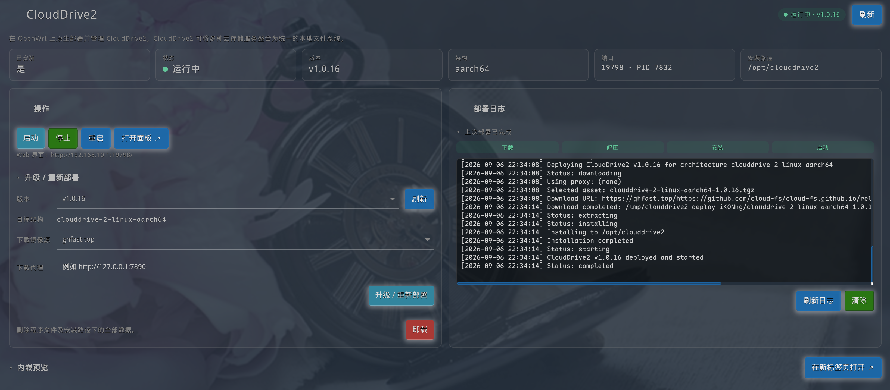

# luci-app-clouddrive-v2

LuCI application to deploy and manage the native CloudDrive2 binary on OpenWrt.

[中文说明](README_zh.md)



Package name in OpenWrt: `luci-app-clouddrive-v2`.


## Features

- Detects the router architecture automatically and downloads the matching CloudDrive2 release from GitHub.
- Checks deployment status (installed/running/version/path/port).
- Lists available CloudDrive2 versions from the upstream GitHub releases page.
- Provides one-click deploy/upgrade, start, stop, restart and uninstall actions.
- Opens the CloudDrive2 web UI in a new tab or embeds it as an inline iframe preview.
- Displays deployment logs in real time.

## Architecture Support

CloudDrive2 upstream provides prebuilt binaries for the following Linux architectures:

| OpenWrt `uname -m` | CloudDrive2 asset prefix        |
|--------------------|---------------------------------|
| `x86_64`           | `clouddrive-2-linux-x86_64`     |
| `aarch64`          | `clouddrive-2-linux-aarch64`    |
| `armv7l` / `armv7` | `clouddrive-2-linux-armv7`      |

MIPS and other architectures are not supported by upstream.

## Installation Path

The default installation path is `/opt/clouddrive2` and can be changed via UCI:

```sh
uci set clouddrive2.config.install_path='/mnt/sda1/clouddrive2'
uci commit clouddrive2
```

If your router's overlay partition is small, move the installation path to an external ext4 partition.

## Files

- `/etc/config/clouddrive2` – UCI configuration
- `/etc/init.d/clouddrive2` – procd service wrapper
- `/usr/sbin/clouddrive2-ctl` – deployment and management backend
- `/usr/share/luci/menu.d/luci-app-clouddrive-v2.json` – LuCI menu entry
- `/usr/share/rpcd/acl.d/luci-app-clouddrive-v2.json` – ACL permissions

## Notes

- The package depends on `curl`, `wget-ssl`, `fuse3-utils` and `jsonfilter`.
- The backend script prefers `curl` at runtime and falls back to `wget-ssl` / `wget` if `curl` is unavailable.
- CloudDrive2 requires FUSE to mount cloud storage locally. `fuse3-utils` pulls `libfuse3` → `kmod-fuse`, but the running kernel must also have FUSE support enabled.
- If LuCI is accessed over HTTPS, the HTTP CloudDrive2 iframe may be blocked by the browser due to mixed-content policies. Use the "Open in New Tab" button in that case.
